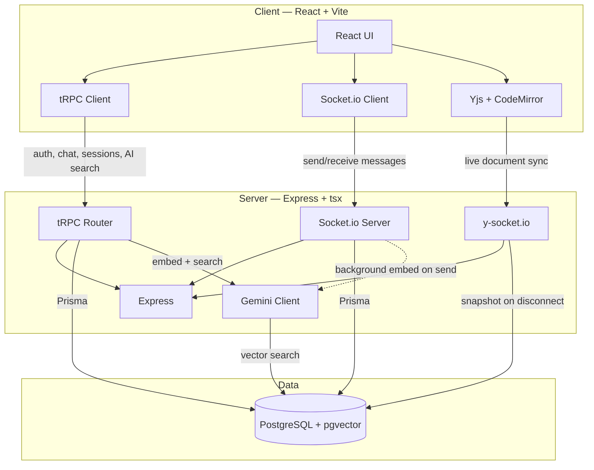

# DevChat

A real-time chat application for developers, built on a full TypeScript stack
with a collaborative code editor and AI-powered semantic search over chat
history.

Originally built as InteractPro (React + Express + MongoDB), then migrated in
six phases to the stack below.

## Features

- Real-time direct messaging over Socket.io
- **Collaborative code editor** — multiple people edit the same file live,
  with visible cursors, powered by a CRDT (Yjs)
- **AI semantic search** — ask a question in plain English and get an answer
  that cites the real chat messages it came from, using Gemini + pgvector
- Full end-to-end type safety from database to UI via Prisma + tRPC

## Architecture



**Two different real-time systems, on purpose:** chat messages are pushed
over Socket.io because the server needs to notify a browser without being
asked (a request-response API like tRPC has no way to do that). The
collaborative editor uses a separate real-time layer, `y-socket.io`, because
editing needs a CRDT merge protocol, not just message delivery — two people
typing at once must always converge to the same text, which plain
message-passing doesn't guarantee.

## Tech Stack

| Layer | Technology |
|---|---|
| Client | React 18.3, TypeScript, Vite 5.3, Tailwind CSS 3.4, Zustand 4.5, React Query (TanStack) 5.101 |
| API | tRPC 11.18 (end-to-end types, no REST boilerplate) |
| Real-time chat | Socket.io 4.8 |
| Collaborative editor | Yjs 13.6 (CRDT) + `y-socket.io` 1.1 + CodeMirror 6 (`y-codemirror.next`) |
| Database | PostgreSQL 16 + pgvector, via Prisma 6.19 |
| AI | Google Gemini (`gemini-embedding-001` for search, `gemini-2.5-flash` for generation), via `@google/genai` 2.17 |
| Testing | Vitest 2.1, Supertest — 71 server-side tests |
| Dev environment | Docker Compose (Postgres), `tsx` (server), Vite dev server (client) |

Data model (`Server/prisma/schema.prisma`): `User`, `Message`, `CodeSession`,
`SessionParticipant`, `Embedding`.

## Getting Started

### Prerequisites

- Node.js 20+
- Docker (for PostgreSQL)
- A free Gemini API key from [Google AI Studio](https://aistudio.google.com/apikey) — optional; the app runs fully without one, with AI search disabled

### Setup

```bash
git clone <repo-url>
cd InteractPro-ChatApplication

# start the database
docker compose up -d

# server
cd Server
cp .env.example .env   # fill in JWT_KEY at minimum; GEMINI_API_KEY is optional
npm install
npx prisma db push
npm run dev

# client, in a second terminal
cd Client
cp .env.example .env
npm install
npm run dev
```

Open `http://localhost:5173`.

### Running the tests

```bash
cd Server
npm test
```

## Project Structure

```
Client/          React + Vite frontend
Server/          Express + tRPC backend
  trpc/          tRPC routers (auth, chat, codeSession, ai)
  lib/ai/        Gemini client, embedding storage, background ingestion
  yjs/           collaborative editor server (y-socket.io + snapshots)
  prisma/        database schema and migrations
  tests/         71 Vitest tests
```

## Known Limitations

- **Dark theme only.** No light-mode toggle exists yet — every component uses
  hardcoded dark colors rather than theme-aware tokens. A light theme would be
  a natural next addition but touches enough components that it didn't fit
  cleanly into a polish pass.
- File attachments in chat are not yet implemented — the UI element exists but
  is not wired to an upload flow.
